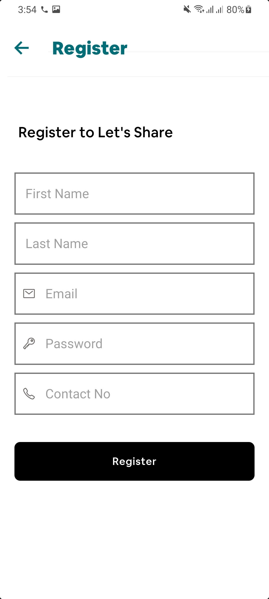

## About The Project

Let’s Share is a P2P and also a B2B sharing economy platform that serves a purpose which all of us in life need. It will allow its user to Share underutilized assets (Daily things that we use) with other users in the same or nearby area. A user can share his assets for free or by charging another user. It is a sharing economy platform that connects people who can share any extra Space, Ride, Food, or Goods with people in need of it.

## App UI ScreenShots

<p align="center">

<a>
    
    
    
    
    
    
    
    
    
    
    
    
    
    
    
    
    
    
    
    
    
</a>
</p>

### Installation

1. Clone the repo
   ```sh
   git clone https://github.com/AsadBaig039/Lets_Share.git
   ```
2. Install NPM packages

   ```sh
   npm install
   ```

### Run Application

1. Navigate to the directory src > res > constants > maps.js
2. Enter Your API_KEY (to enable map view and google places services)
3. Open VSCode Terminal

4. Run the Command
   ```sh
   react-native run-android
   ```

## Contact

ASAD BAIG - [asad.baig039@gmail.com](asad.baig039@gmail.com)

Project Link: [https://github.com/AsadBaig039/Lets_Share.git](https://github.com/AsadBaig039/Lets_Share.git)

<!-- ACKNOWLEDGEMENTS -->

## Acknowledgements

- [Vector Icons](https://www.npmjs.com/package/react-native-vector-icons)
- [Google developer console API services](https://console.cloud.google.com/apis/)
- [React native Navigation](https://reactnavigation.org/)
  [Cloudinary](https://cloudinary.com/home-6-4-video-b)
- [Formik](https://www.npmjs.com/package/react-native-formik)
- [Yup](https://www.npmjs.com/package/yup)
- [Lottie](https://lottiefiles.com/)
